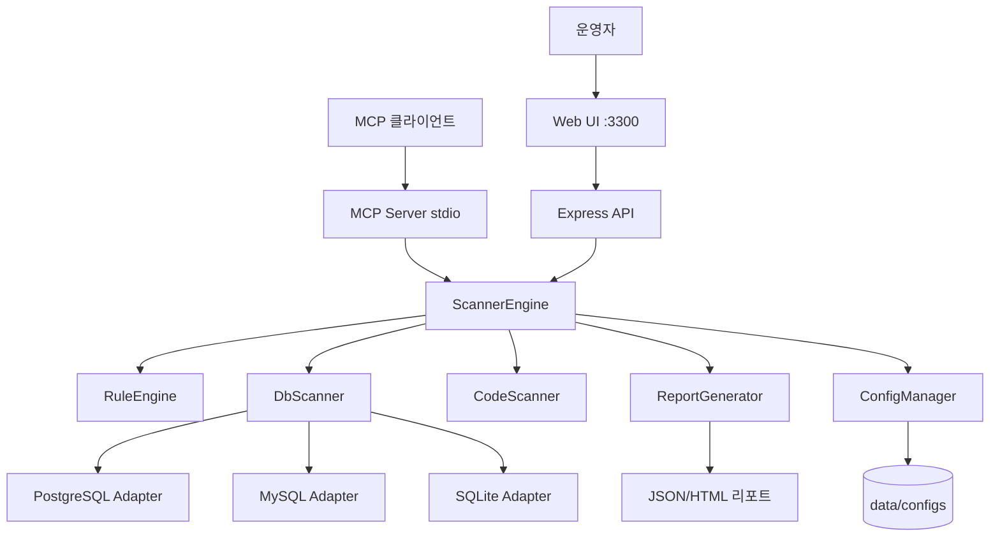

# Sensitive Info Scanner MCP 아키텍처

## 목표

이 프로젝트는 Docker 기반으로 실행되는 민감정보 스캐너다. 로컬 코드 저장소와 RDBMS를 스캔해 민감정보를 검출하고, 웹 UI 및 MCP 도구로 결과를 제공한다.

핵심 목표:

- 코드/DB를 함께 스캔하는 단일 코어 엔진
- DB 읽기전용 강제 및 스키마 필수 지정으로 안전성 확보
- Docker compose 한 번으로 웹 UI와 MCP 서버 실행

## 시스템 개요

## 런타임 구성

### web 서비스

- 컨테이너 포트: `3300`
- 명령: `npm run web`
- 역할: 설정 입력, 스캔 실행, 진행상태 모니터링, 리포트 조회

### mcp 서비스

- 명령: `npm run mcp`
- 역할: MCP 도구(`list_configs`, `create_config`, `start_scan`, `get_scan_progress`, `get_scan_report`, `list_scans`) 제공

### 데이터 볼륨

- `./data:/app/data`
- 설정 파일 저장: `data/configs/*.json`

## 핵심 설계

### 1. Core + Adapter 구조

- Core(`ScannerEngine`)는 스캔 흐름만 담당
- DB 접속 세부 구현은 Adapter로 분리
- 신규 DB(향후 NoSQL)는 scanner/adapter만 추가하면 확장 가능

### 2. 민감정보 탐지 2단계

- 코드: 라인 기반 정규식 매칭 + 레드액션
- DB: 컬럼명 패턴 + 데이터 샘플링 + 통계 수집

### 3. 신뢰성 가드레일

- PostgreSQL: 세션 읽기전용 강제
- MySQL: 읽기전용 트랜잭션 강제
- SQLite: readonly 연결 강제
- PostgreSQL/MySQL: `schemas` 미지정 시 스캔 거부

## 동작 흐름

1. 사용자가 Web UI 또는 MCP에서 스캔 설정을 생성
2. `ScannerEngine.startScan` 호출로 비동기 스캔 시작
3. DB/코드 스캐너가 병렬이 아닌 안전 순차 방식으로 실행
4. 진행상태는 인메모리 Progress 맵으로 조회
5. 완료 후 리포트(JSON/HTML) 생성 및 조회 가능

## 향후 확장

- NoSQL 스캐너(MongoDB/Redis) 추가
- 룰 버전 관리 및 조직별 커스텀 룰셋
- 스캔 결과 영속화(`data/reports`) 및 이력 비교
- 알림(Webhook/Slack) 연동
